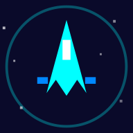

# 🚀 Retro Space Shooter

A retro-style space shooter game built with vanilla HTML5 Canvas and JavaScript. Defend the galaxy from waves of alien invaders!



## 🎮 Play

Open `index.html` in any modern browser or install it as a PWA on your mobile device.

**Live Demo:** Deploy to GitHub Pages or any static hosting.

## ✨ Features

- **4 Unique Ships** — Fighter, Destroyer, Phantom, and Vanguard, each with different stats
- **8 Enemy Types** — Grunts, Zigzags, Chargers, Snipers, Tanks, Splitters, Swarms, and Bosses
- **Progressive Difficulty** — Game starts easy and gradually increases in challenge
- **Power-ups** — Weapon upgrades, shields, rapid fire, wingman drones, extra lives, and bombs
- **3 Ultimate Abilities** — Time Warp, Plasma Beam, and Vortex (unlocked by score)
- **Combo System** — Kill enemies quickly for score multipliers up to x5
- **Boss Battles** — Every 5 levels features a boss with multiple attack patterns
- **Retro Audio** — Procedurally generated sound effects and background music
- **PWA Support** — Install on mobile devices for offline play
- **Mobile Optimized** — Touch controls with landscape-only mode for the best experience

## 🕹️ Controls

### Desktop
| Key | Action |
|-----|--------|
| ← → / A D | Move horizontally |
| ↑ ↓ / W S | Move vertically |
| SPACE | Shoot |
| P | Pause |
| 1 | Time Warp (ultimate) |
| 2 | Plasma Beam (ultimate) |
| 3 | Vortex (ultimate) |

### Mobile
- **◀ ▶ buttons** — Move left/right
- **Fire button** — Hold to shoot
- **Ultimate buttons** — Tap to activate unlocked abilities
- **⏸ button** — Pause game

> 📱 **Note:** On mobile devices, the game requires landscape orientation for the best experience.

## 🛸 Ships

| Ship | Speed | Attack | Defense | Fire Rate |
|------|-------|--------|---------|-----------|
| ⚡ Fighter | ★★★★ | ★★★ | ★★ | ★★★★ |
| 🛡️ Destroyer | ★★ | ★★★★ | ★★★★★ | ★★ |
| 💨 Phantom | ★★★★★ | ★★ | ★ | ★★★★★ |
| 🎯 Vanguard | ★★★ | ★★★★ | ★★★ | ★★★ |

## 👾 Enemies

- **Grunt** — Basic invader, moves steadily downward
- **Zigzag** — Weaves side to side unpredictably
- **Charger** — Accelerates faster and faster
- **Sniper** — Stops to aim directly at you
- **Tank** — Heavy armor with side cannons
- **Splitter** — Breaks into smaller aliens on death
- **Swarm** — Tiny triangles that hunt in groups
- **Boss** — Massive warship with multiple attack phases

## 🎯 Power-ups

| Icon | Power-up | Effect |
|------|----------|--------|
| 🔫 | Weapon Up | Upgrades weapon level (temporary) |
| 🛡️ | Shield | Absorbs damage (temporary) |
| ⚡ | Rapid Fire | Increases fire rate (temporary) |
| 🛸 | Wingman | Spawns a helper drone (temporary) |
| ❤️ | Extra Life | +1 life |
| 💣 | Bomb | Destroys all enemies on screen |

## 🌟 Ultimate Abilities

Unlocked by reaching score thresholds:

| Ability | Unlock | Cooldown | Effect |
|---------|--------|----------|--------|
| ⏳ Time Warp | 500 pts | 20s | Slows all enemies and bullets |
| 🔥 Plasma Beam | 2,000 pts | 25s | Devastating vertical beam |
| 🌀 Vortex | 5,000 pts | 30s | Black hole pulls and damages enemies |

## 📱 Installation (PWA)

1. Open the game in Chrome/Safari on your mobile device
2. Tap "Add to Home Screen" or use the install prompt
3. The game will be available as a standalone app with offline support

## 🛠️ Tech Stack

- **HTML5 Canvas** — Game rendering
- **Vanilla JavaScript** — Game logic, no frameworks
- **Web Audio API** — Procedural sound effects
- **Service Worker** — Offline caching for PWA
- **CSS3** — UI, responsive design, and animations

## 📁 Project Structure

```
Space-Shooter-Game/
├── index.html          # Main HTML with UI and styles
├── game.js             # Core game logic
├── sw.js               # Service worker for offline support
├── manifest.json       # PWA manifest
├── icons/              # App icons (SVG)
├── DEPLOY.md           # Deployment instructions
└── README.md           # This file
```

## 🚀 Deployment

See [DEPLOY.md](DEPLOY.md) for deployment instructions.

### Quick Deploy to GitHub Pages

```bash
git add .
git commit -m "Deploy space shooter"
git push origin main
```

Then enable GitHub Pages in your repository settings (Settings → Pages → Source: main branch).

## 📄 License

MIT License — feel free to use, modify, and distribute.

---

Made with ❤️ and JavaScript
