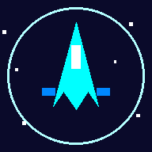

# 🚀 Retro Space Shooter

A retro-style space shooter game built with vanilla HTML5 Canvas and JavaScript. Defend the galaxy from waves of alien invaders!



## 🎮 Play

**Live Demo:** [https://ricardocorreia99.github.io/Space-Shooter-Game/](https://ricardocorreia99.github.io/Space-Shooter-Game/)

Open `index.html` in any modern browser or install it as a PWA on your mobile device.

## ✨ Features

- **4 Unique Ships** — Fighter, Destroyer, Phantom, and Vanguard, each with different stats
- **8 Enemy Types** — Grunts, Zigzags, Chargers, Snipers, Tanks, Splitters, Swarms, and Bosses
- **Progressive Difficulty** — Game starts easy and gradually increases in challenge over time and levels
- **Power-ups** — Weapon upgrades, shields, rapid fire, wingman drones, extra lives, and bombs
- **3 Ultimate Abilities** — Time Warp, Plasma Beam, and Vortex (unlocked by score)
- **Combo System** — Kill enemies quickly for score multipliers up to x5
- **Boss Battles** — Every 5 levels features a boss with multiple attack patterns
- **Retro Audio** — Procedurally generated sound effects and background music
- **PWA Support** — Install on mobile devices (iOS & Android) for offline play
- **Mobile Optimized** — Virtual joystick for full directional control, landscape support
- **iOS Compatible** — Full support for Apple touch icons and Add to Home Screen

## 🕹️ Controls

### Desktop
| Key | Action |
|-----|--------|
| ← → / A D | Move horizontally |
| ↑ ↓ / W S | Move vertically |
| SPACE | Shoot |
| P | Pause |
| 1 | Time Warp (ultimate) |
| 2 | Plasma Beam (ultimate) |
| 3 | Vortex (ultimate) |

### Mobile
- **Virtual Joystick** — Drag in any direction to move (left side of screen)
- **Fire button** — Hold to shoot (right side of screen)
- **Ultimate buttons** — Tap to activate unlocked abilities (top-right)
- **⏸ button** — Pause game

> 📱 **Note:** On mobile devices, the game can be used with landscape orientation for the best full-screen experience.

## 🛸 Ships

| Ship | Speed | Attack | Defense | Fire Rate |
|------|-------|--------|---------|-----------|
| ⚡ Fighter | ★★★★ | ★★★ | ★★ | ★★★★ |
| 🛡️ Destroyer | ★★ | ★★★★ | ★★★★★ | ★★ |
| 💨 Phantom | ★★★★★ | ★★ | ★ | ★★★★★ |
| 🎯 Vanguard | ★★★ | ★★★★ | ★★★ | ★★★ |

## 👾 Enemies

- **Grunt** — Basic invader, moves steadily downward
- **Zigzag** — Weaves side to side unpredictably
- **Charger** — Accelerates faster and faster
- **Sniper** — Stops to aim directly at you
- **Tank** — Heavy armor with side cannons
- **Splitter** — Breaks into smaller aliens on death
- **Swarm** — Tiny triangles that hunt in groups
- **Boss** — Massive warship with multiple attack phases

## 🎯 Power-ups

| Icon | Power-up | Effect |
|------|----------|--------|
| 🔫 | Weapon Up | Upgrades weapon level (temporary) |
| 🛡️ | Shield | Absorbs damage (temporary) |
| ⚡ | Rapid Fire | Increases fire rate (temporary) |
| 🛸 | Wingman | Spawns a helper drone (temporary) |
| ❤️ | Extra Life | +1 life |
| 💣 | Bomb | Destroys all enemies on screen |

## 🌟 Ultimate Abilities

Unlocked by reaching score thresholds:

| Ability | Unlock | Cooldown | Effect |
|---------|--------|----------|--------|
| ⏳ Time Warp | 500 pts | 15s | Slows all enemies and bullets for 10s |
| 🔥 Plasma Beam | 2,000 pts | 18s | Devastating vertical beam for 4s |
| 🌀 Vortex | 5,000 pts | 20s | Black hole pulls and damages enemies for 8s |

## 📱 Installation (PWA)

1. Open the game URL in Chrome (Android) or Safari (iOS)
2. **Android:** Tap ⋮ menu → "Install app" or "Add to Home screen"
3. **iOS:** Tap Share button (□↑) → "Add to Home Screen"
4. The game will be available as a standalone app with offline support

> **Tip:** If the app doesn't work after installing, clear site data and reinstall.

## 🛠️ Tech Stack

- **HTML5 Canvas** — Game rendering
- **Vanilla JavaScript** — Game logic, no frameworks
- **Web Audio API** — Procedural sound effects
- **Service Worker** — Offline caching for PWA (network-first strategy)
- **CSS3** — UI, responsive design, and animations
- **Python/Pillow** — Icon generation (PNG for iOS compatibility)

## 📁 Project Structure

```
Space-Shooter-Game/
├── index.html          # Main HTML with UI and styles
├── game.js             # Core game logic
├── sw.js               # Service worker for offline support
├── manifest.json       # PWA manifest
├── apple-touch-icon.png # iOS home screen icon (180x180)
├── icons/              # App icons (PNG + SVG)
│   ├── icon-*.png      # PNG icons for iOS/PWA
│   ├── icon-*.svg      # SVG source icons
│   └── apple-touch-icon.png
├── generate-pngs.py    # Script to regenerate PNG icons
├── LICENSE             # Proprietary License (All Rights Reserved)
└── README.md           # This file
```

### Quick Deploy to GitHub Pages

```bash
git add .
git commit -m "Deploy space shooter"
git push origin main
```

Then enable GitHub Pages in your repository settings (Settings → Pages → Source: main branch).

## 📄 License

**© 2026 Ricardo Correia. All Rights Reserved.**

This project is proprietary software. No permission is granted to use, copy, modify, merge, publish, distribute, sublicense, or sell copies of this software without prior written permission from the copyright holder.

Viewing the source code on GitHub does **not** constitute a license to use, copy, or distribute the software in any form.

See the [LICENSE](LICENSE) file for the full license terms.

---
